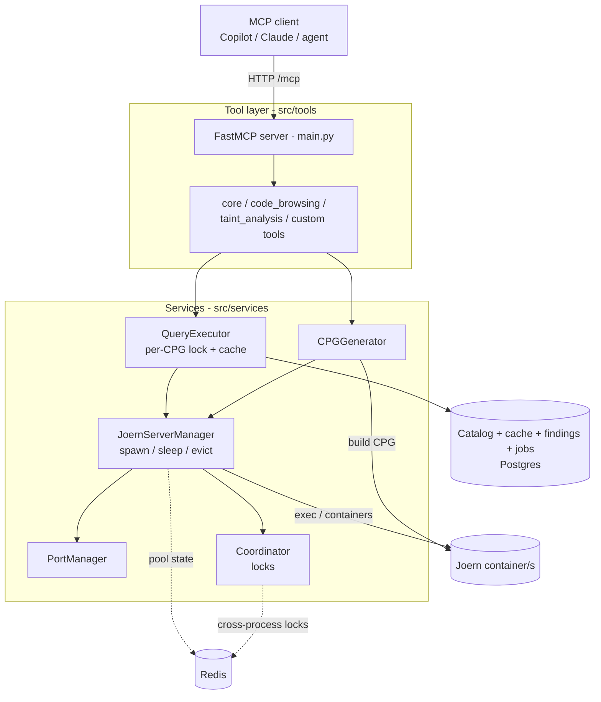
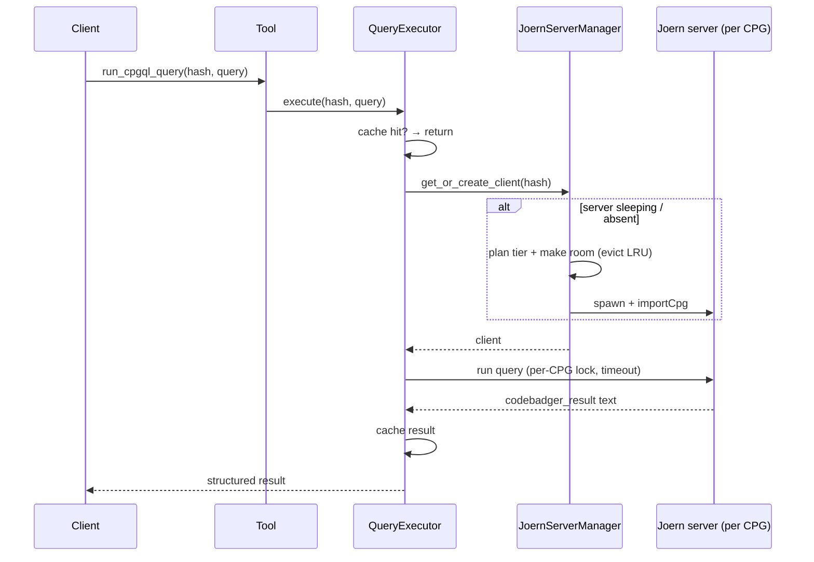
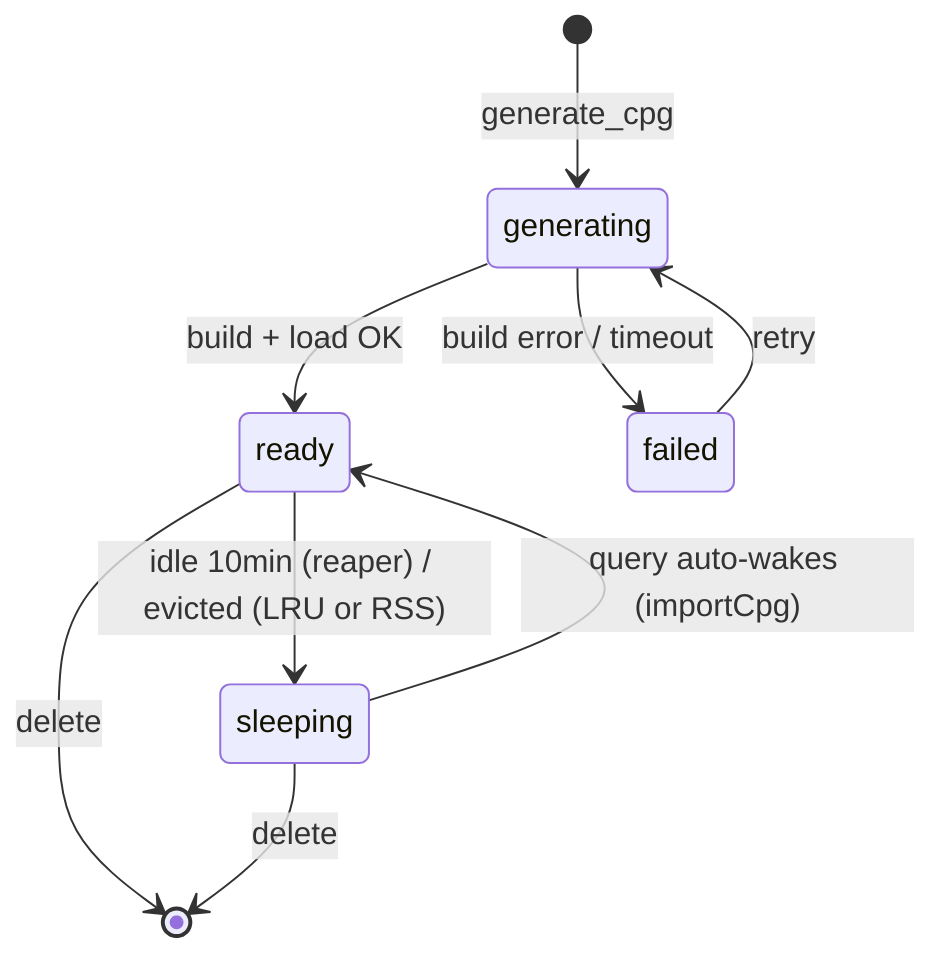
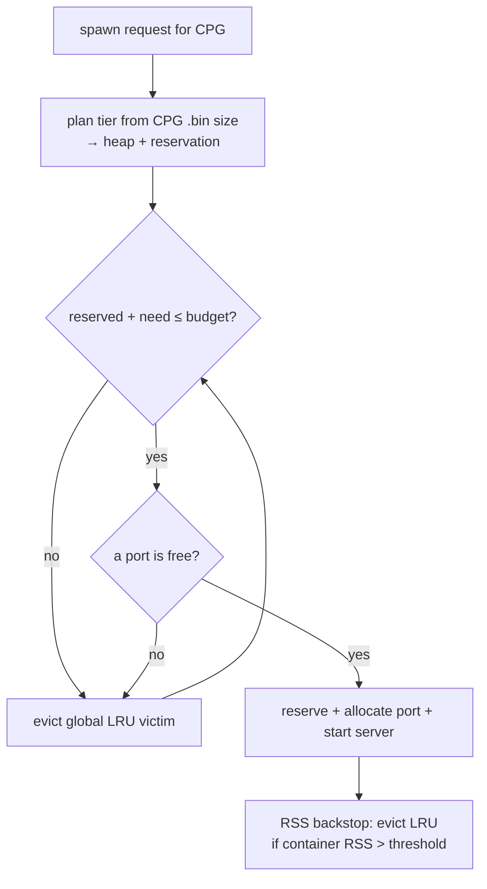

# Architecture

codebadger wraps Joern's CPG engine behind an MCP server. Joern runs
**out-of-process** inside Docker; the Python server orchestrates CPG generation,
a memory-aware pool of query servers, caching, and a durable job queue.

## System overview



- **Tool layer** - every MCP tool is a thin function that renders a CPGQL query and
  calls a service. Detectors live in `taint_analysis_tools.py` / `custom_tools.py`.
- **`QueryExecutor`** - serializes requests per CPG (one Joern JVM per CPG), caches
  successful results, and triggers auto-wake.
- **`JoernServerManager`** - the heart: spawns query servers, sizes their heaps,
  enforces the memory budget, offloads idle servers (idle-TTL reaper), and evicts
  under pressure. Ports return to the pool on every eviction/offload.
- **Storage** - **Postgres** holds the whole store: catalog, tool cache,
  findings, and the durable job queue. **Redis** holds the cross-process query
  locks and the pool ledger. The server fails to boot if either is unreachable.

## Query flow (with auto-wake)



## CPG / server lifecycle



CPGs are cached on disk by content hash, so a sleeping server costs no RAM and
wakes by re-loading the cached `.bin` on the next query.

## Memory-aware admission

RAM is the binding constraint: each server is a JVM heap. Admission is governed
by a **memory budget**, not a fixed server count.



- **Budget** (`memory_budget_mb`) - sum of per-CPG heap reservations may not exceed
  this; it's the real concurrency limit. The count cap is just a safety ceiling.
- **Tiers** - heap is sized to the CPG's on-disk size (S/M/L/XL), so a batch of
  small CPGs runs far more servers concurrently than a few large ones.
- **Eviction** - least-recently-used servers are put to sleep to make room; an
  RSS-pressure backstop evicts before the kernel OOM-kills. A background reaper
  also offloads servers idle past `JOERN_IDLE_TTL_SECONDS` (default 600s) so a
  finished codebase stops pinning RAM; the next query reactivates it.
- **Cross-process** (`pool` mode + Redis) - the reservation ledger, warm-worker
  registry, global LRU, and per-CPG spawn lock live in Redis, so many processes
  admit/evict against one shared budget. See [Deployment](deployment.md#shared-vs-pool-mode).

## Design decisions

- **Joern out-of-process in Docker.** Isolates the JVM heaps from the Python
  server and lets `pool` mode cgroup-cap each worker so one OOM can't cascade.
- **One JVM per CPG + per-CPG query lock.** A Joern server holds one CPG; the lock
  serializes queries to it. Cross-process safety comes from the Redis lock.
- **Generate-ahead, sleep-on-idle.** Decouples generation memory from query
  memory; disk-cached CPGs make wake cheap. Critical for large batches.
- **Durable queue (DB jobs table).** Survives restarts, dedups (one active job per
  CPG via a partial unique index), and applies backpressure (`FOR UPDATE SKIP
  LOCKED`) instead of silently dropping - unlike the in-memory queue.
- **Postgres as the single store.** Moving catalog + cache + findings + queue into
  one Postgres is what makes genuine multi-process operation possible.
- **Auto-tuned memory with an over-commit guard.** Budgets derive from host RAM;
  a startup guard clamps (and warns) rather than letting build + query pools
  jointly over-commit the host.

## Health & observability

`GET /health` is the operator's single view of the deployment. It probes every
dependency concurrently (bounded timeout, so a hung backend can't stall the
endpoint) and rolls them into one status:

- `status` ∈ `up | partial | down`, plus `mcp: "codebadger"` and a
  `dependencies` map: `joern`, `postgres`, `redis`, `docker`, `cpg_queue` (each
  `up`/`partial`/`down`). Per-dependency detail (ping latency, port pool, memory
  ledger, queue depth) lives under `checks`.
- **Aggregation**: `down` if any of postgres/redis/docker/joern is down (Joern is
  the analysis engine, so its loss is a full outage); `partial` for softer
  degradation (e.g. queue full, memory budget near-exhausted); else `up`.
- **HTTP codes**: 200 for `up`/`partial`, 503 for `down` — so a load balancer or
  orchestrator takes a `down` instance out of rotation.

Every run also writes a per-run file log (`logs/codebadger-<ts>-<pid>.log`, with
a `codebadger-latest.log` symlink) alongside stdout, and a compact status block
logs on an interval.

## Repository layout

```text
main.py                      MCP server entry point, lifespan, health, status logger
config.yaml / src/defaults   configuration + centralized defaults
src/
  tools/        core_tools, code_browsing_tools, taint_analysis_tools, custom_tools, queries/*.scala
  services/     joern_server_manager, query_executor, cpg_generator, codebase_tracker,
                coordination, pool_store, port_manager, git_manager
  utils/        postgres_db_manager, postgres_job_store, recommend,
                validators, cpgql_validator, cache_cleanup, logging
scripts/        recommend_config.py
tests/          unit + integration suites
```
