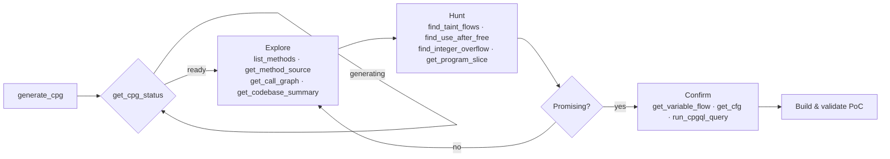

# Available Tools

codebadger exposes its analysis capabilities as **MCP tools** that an LLM client
(Copilot, Claude, or any MCP agent) can call directly. Every tool takes a
`codebase_hash` (returned by `generate_cpg`) unless noted, runs a CPGQL query
against that codebase's Code Property Graph, and returns a structured JSON result.

The tools fall into six groups:

| Group | Purpose |
|-------|---------|
| [CPG lifecycle](#cpg-lifecycle) | Build, check, and free CPGs. |
| [Code browsing](#code-browsing) | Navigate methods, files, calls, and source. |
| [Semantic analysis](#semantic-analysis) | Control flow, types, macros, raw CPGQL. |
| [Taint analysis & slicing](#taint-analysis--slicing) | Track untrusted data and data dependencies. |
| [Vulnerability detectors](#vulnerability-detectors) | Memory-safety and CWE-specific scanners. |
| [Reconnaissance & extensibility](#reconnaissance--extensibility) | Git-history hints and your own detectors. |

> **Languages:** C, C++, Java, JavaScript, Python, Go, Kotlin, C#, PHP, Ruby,
> Swift, Ghidra, and Jimple. The memory-safety detectors are C/C++-focused;
> taint, browsing, and semantic tools work across all supported languages.

---

## CPG lifecycle

These manage the analysis artifact itself — the CPG is generated once and reused.

| Tool | What it does |
|------|--------------|
| `generate_cpg` | Build a CPG for a codebase. Accepts a **GitHub URL** (cloned first), a **local path** (copied into the workspace), or a pasted **code snippet** (`source_type="snippet"` with the code in `code`); a sub-path keeps large repos small. Returns immediately with a `codebase_hash` and builds in the background. CPGs are cached on disk by content hash, so re-runs are instant. |
| `get_cpg_status` | Check whether a CPG is `generating`, `ready`, `sleeping`, or `failed`, and get the Joern server port if running. **Poll this** after `generate_cpg` until `ready`. |
| `remove_cpg` | Free resources for a codebase. By default it terminates the Joern process and releases the port but **keeps the CPG `.bin`** on disk (status → `sleeping`) for fast re-activation. Pass `delete_files=True` to delete the cached artifacts entirely. |

---

## Code browsing

Orient yourself in an unfamiliar codebase — the equivalent of grep, "go to
definition," and a call hierarchy, but graph-backed.

| Tool | What it does |
|------|--------------|
| `list_methods` | List methods/functions, with optional regex filters on name and file. |
| `list_files` | List source files as a paginated tree, optionally scoped to a sub-path. |
| `get_method_source` | Retrieve the actual source code of a method (by exact name or regex). |
| `get_code_snippet` | Pull a line range from a specific file. |
| `list_calls` | List call relationships, filterable by caller and callee pattern. |
| `get_call_graph` | Outgoing (callees) or incoming (callers) call graph for a method, to a given depth. |
| `list_parameters` | Names, types, and order of a method's parameters. |
| `get_codebase_summary` | High-level overview: file count, method count, language, and metadata. |

---

## Semantic analysis

Deeper structural queries about control flow, types, and the macro layer — plus
a raw CPGQL escape hatch.

| Tool | What it does |
|------|--------------|
| `get_cfg` | Human-readable **control-flow graph** for a method (node-capped). |
| `get_type_definition` | Inspect a struct/class memory layout and its members. |
| `get_macro_expansion` | Heuristically flag calls at a location that may be macro expansions (naming/dispatch cues). |
| `find_bounds_checks` | Check whether a buffer access has a corresponding bounds check on the index variable. |
| `run_cpgql_query` | Execute an **arbitrary CPGQL query** — the escape hatch for anything the tools above don't cover. Returns structured results. |
| `get_cpgql_syntax_help` | CPGQL syntax reference, common patterns, node types, and error fixes. Takes no `codebase_hash`. |

---

## Taint analysis & slicing

Track how untrusted data moves through the program and trace data dependencies.
Built on Joern's native dataflow engine (`reachableByFlows`).

| Tool | What it does |
|------|--------------|
| `find_taint_sources` | Locate likely external-input entry points (user input, env vars, network/file reads). |
| `find_taint_sinks` | Locate security-sensitive destinations (command execution, file ops, format strings). |
| `find_taint_flows` | Find concrete data flows from a source to a sink, including intermediate steps. |
| `get_program_slice` | Build a **backward** (what affects it) or **forward** (what it affects) slice from a call location, including dataflow and control dependencies. |
| `get_variable_flow` | Trace the data dependencies of a single variable at a location, with pointer-aliasing support. |

---

## Vulnerability detectors

Purpose-built scanners that encode the query patterns for a specific bug class.
Each returns candidate findings with locations and supporting context. The
memory-safety detectors target **C/C++**.

### Memory safety

| Tool | Bug class |
|------|-----------|
| `find_use_after_free` | Use-After-Free — a pointer used after `free()` (intra- and inter-procedural, plus aliasing). |
| `find_double_free` | Double-Free — multiple `free()` calls on the same pointer. |
| `find_null_pointer_deref` | Null Pointer Dereference (CWE-476) — unchecked `malloc`/`calloc`/`realloc` results dereferenced. |
| `find_heap_overflow` | Heap buffer overflow (CWE-122) — a write that may exceed an allocated buffer. |
| `find_stack_overflow` | Stack buffer overflow (CWE-121) — a write past a fixed-size stack array's bounds. |
| `find_uninitialized_reads` | Uninitialized read (CWE-457) — a variable read before assignment. |

### Arithmetic & format

| Tool | Bug class |
|------|-----------|
| `find_integer_overflow` | Integer overflow/underflow (CWE-190) feeding an allocation or array index. |
| `find_format_string_vulns` | Format-string vulnerability (CWE-134) — a non-literal used as a `printf`-family format argument. |

### Concurrency & injection

| Tool | Bug class |
|------|-----------|
| `find_toctou` | TOCTOU race (CWE-367) — a file checked with `access`/`stat`/`lstat` then operated on separately. |
| `find_command_injection_sinks` | OS command injection (CWE-78) — a shell-exec function receiving a non-literal argument. |

---

## Reconnaissance & extensibility

| Tool | What it does |
|------|--------------|
| `discover_fixed_vulnerabilities` | Optional recon: mine **git commit history** for commits that look like security fixes, to hint at attack surface and past vulnerability patterns. |

**Need a detector that isn't here?** You can add your own CPGQL-backed tool in
minutes without touching the core — see [Custom Tools](custom-tools.md).

---

## Typical workflow

See [Usage](usage.md) for client setup and a worked example session.
