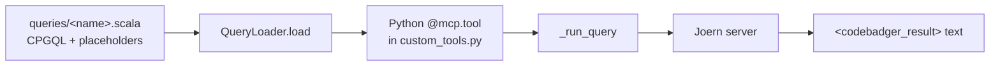

# Custom Tools

Add your own detectors without modifying the core. The server auto-registers
everything in `src/tools/custom_tools.py` on start.

1. Write a Scala query template in `src/tools/queries/<name>.scala`.
2. Register a Python tool in `src/tools/custom_tools.py`.
3. Restart - the tool appears in every connected MCP client.



## 1. Query template

Templates are Scala blocks. Variables use `{{double_braces}}`, substituted at
runtime; user values are sanitized against template injection. Wrap output in
`<codebadger_result>` tags so the parser extracts it cleanly.

```scala
{
  import io.shiftleft.codepropertygraph.generated.nodes._
  import io.shiftleft.semanticcpg.language._

  val myPattern  = "{{my_pattern}}"   // string - keep the quotes
  val maxResults = {{max_results}}    // numeric - no quotes
  val output = new StringBuilder()

  val results = cpg.call.name(myPattern).take(maxResults).l
  if (results.isEmpty) output.append("No findings.\n")
  else results.zipWithIndex.foreach { case (c, i) =>
    output.append(s"--- Finding ${i + 1} ---\n")
    output.append(s"${c.location.filename}:${c.location.lineNumber.getOrElse(-1)}  ${c.code}\n")
  }
  "<codebadger_result>\n" + output.toString() + "</codebadger_result>"
}
```

| Variable kind | Scala | Python call |
|---|---|---|
| String | `val x = "{{x}}"` | `QueryLoader.load("q", x="value")` |
| Integer | `val n = {{n}}` | `QueryLoader.load("q", n=50)` |
| Long (node ID) | `val id = {{id}}L` | `QueryLoader.load("q", id=12345)` |

To filter by file, anchor to a path boundary so `"parser.c"` matches `/src/parser.c`
but not `/src/myparser.c`:

```scala
def pathBoundaryRegex(f: String) = "(^|.*/)" + java.util.regex.Pattern.quote(f) + "$"
```

## 2. Python tool

Add inside `register_custom_tools()` in `src/tools/custom_tools.py`:

```python
@mcp.tool(
    description="""One-line summary shown in client listings.

Args:
    codebase_hash: Hash returned by generate_cpg.
    my_param:      What this controls (default "value").
Returns:
    Text report with findings and locations.
""",
    tags={"security", "CWE-NNN"},
)
def my_tool(
    codebase_hash: Annotated[str, Field(description="Codebase hash from generate_cpg")],
    my_param: Annotated[str, Field(description="Detection pattern")] = "default",
    max_results: Annotated[int, Field(description="Max findings", ge=1, le=500)] = 50,
) -> str:
    try:
        info = _get_codebase(services, codebase_hash)
        query = QueryLoader.load("my_tool", my_pattern=my_param, max_results=max_results)
        return _run_query(
            services, codebase_hash, info.cpg_path, query,
            timeout=60, tool_name="my_tool",
            cache_params={"my_param": my_param, "max_results": max_results},
        )
    except (ValueError, RuntimeError) as e:
        return f"Error: {e}"
    except Exception as e:
        logger.error(f"my_tool: {e}", exc_info=True)
        return f"Internal Error: {e}"
```

Then `docker compose restart codebadger` (or restart `main.py`).

### Helpers

- **`_get_codebase(services, hash) → CodebaseInfo`** - validates the hash; raises
  `ValueError` if unknown. Fields: `.cpg_path`, `.language`, `.source_path`, `.metadata`.
- **`_run_query(services, hash, cpg_path, query, *, timeout, tool_name, cache_params) → str`**
  - renders + executes the query, extracts `<codebadger_result>`. Passing
  `tool_name` + `cache_params` caches the result (TTL `query.cache_ttl`); omit both
  to always run fresh. Raises `RuntimeError` on failure.
- **`QueryLoader.load(name, **kwargs) → str`** - loads `queries/<name>.scala`,
  substitutes `{{key}}` placeholders, caches the template in memory.

The `services` dict also exposes `query_executor`, `codebase_tracker`,
`db_manager`, and `config` for cases the helpers don't cover.

### Tags

Use tags so clients/agents can discover tools: `"security"`, `"code-quality"`,
`"taint"`, `"memory-safety"`, `"injection"`, `"attack-surface"`, `"CWE-NNN"`.

## Tips

- Prototype the CPGQL with the built-in `run_cpgql_query` tool first; move it to a
  `.scala` file once stable.
- `find_command_injection_sinks` is the reference implementation - copy it.

## Design decisions

- **Queries live in `.scala` files, not inline Python.** Each piece is editable
  independently; `QueryLoader` caches templates so there's no per-query I/O.
- **`<codebadger_result>` wrapping over `.toJsonPretty`.** Analysis tools produce
  readable multi-section text reports; `.toJsonPretty` is reserved for simple
  collection traversals that need raw JSON.
- **Template-injection sanitization.** Any `{{` inside a supplied value is escaped,
  so a crafted value can't overwrite another template variable.
- **Tools return `str`, not `Dict`.** Consistent type so clients display results
  without unwrapping.
- **`_get_codebase` / `_run_query` are thin helpers, not abstractions** - they
  remove boilerplate but don't hide `services[...]`.
