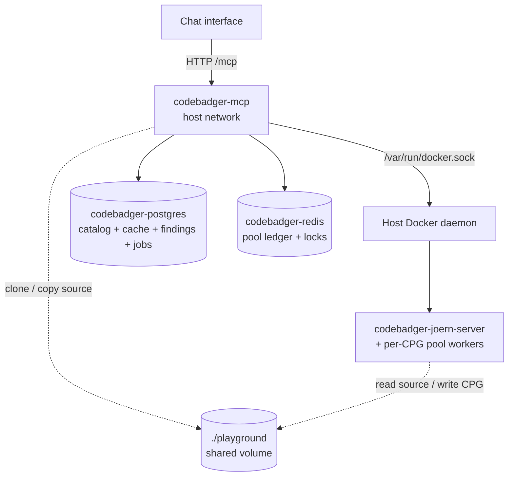
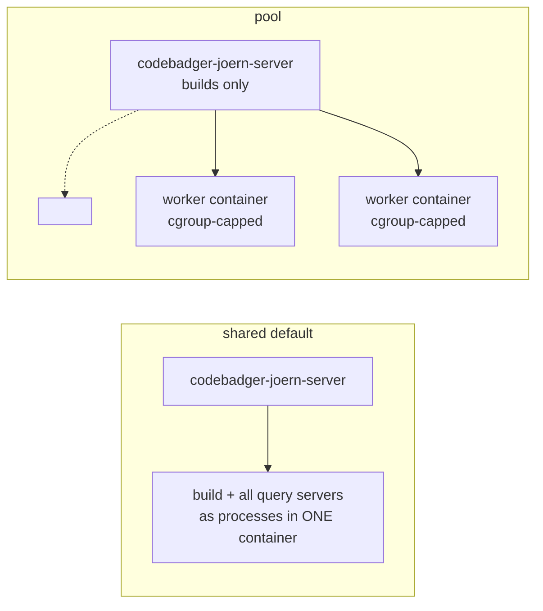

# Deployment

The whole stack — the **MCP server**, the **Joern** container, **Postgres**, and
**Redis** — runs from a single `docker compose`. The MCP server runs in its own
container (`Dockerfile.mcp`) and drives the host Docker daemon to build CPGs and
spawn per-CPG Joern workers.



## Prerequisites

- **Docker Engine** + the **Compose v2 plugin** (`docker compose version`). Install: <https://docs.docker.com/engine/install/>.
- Permission to use the Docker socket (the deploy user is in the `docker` group, or runs as root). The MCP container drives the host daemon via `/var/run/docker.sock`.
- **A host dedicated to CodeBadger.** Mounting the Docker socket gives the MCP container root-equivalent control of the host (see the trust-boundary note below).
- Disk for the `playground/` volume (cloned sources + CPG `.bin` caches can reach tens of GB) and RAM for the Joern JVMs (see [Sizing](#sizing-for-your-host)).
- `git` is only needed if you clone this repo to the host; everything else runs in containers.

## Quick start (full stack)

```bash
# 1. Get the code
git clone http://github.com/lekssays/codebadger && cd codebadger

# 2. Configure for your host: copy the template and edit
cp .env.example .env
#   Set at minimum:
#     PLAYGROUND_HOST_PATH=/abs/path/to/codebadger/playground   # ABSOLUTE
#     MCP_HOST=0.0.0.0                                           # or 127.0.0.1 behind a proxy
#   Size memory for your host (RAM is the binding constraint):
python scripts/recommend_config.py        # prints JOERN_MEM_LIMIT / JOERN_MEMORY_BUDGET_MB to set

# 3. Build images + start everything + wait for /health
./scripts/deploy.sh

# 4. Confirm it's serving
./scripts/deploy.sh status
```

`docker compose` auto-loads `.env`, so once it's filled in, plain `docker compose
up -d` works too. `deploy.sh` additionally exports an **absolute**
`PLAYGROUND_HOST_PATH` (pool workers are started by the host daemon, so their
`playground` bind-mount source must be host-absolute) and waits for `/health`.

To run Compose directly without the script, just make sure that path is absolute:

```bash
PLAYGROUND_HOST_PATH="$PWD/playground" docker compose up -d --build
```

The MCP container uses **host networking** and mounts the Docker socket, so the
`localhost:<published-port>` wiring (Joern servers, Postgres `55432`, Redis
`56379`, and the MCP's own `:4242`) works unchanged.

> **Trust boundary:** mounting `/var/run/docker.sock` gives the MCP container
> root-equivalent control of the host. Run it on a host dedicated to CodeBadger.
> Host networking is required by the published-port + sibling-container model.

### Verify it's healthy

`GET /health` reports `status` (`up`/`partial`/`down`), `mcp: "codebadger"`, and a
`dependencies` map (joern, postgres, redis, docker, cpg_queue). It returns HTTP
200 for `up`/`partial` and 503 for `down`, so it works directly as an
orchestrator liveness/readiness probe.

```bash
curl -s http://localhost:4242/health | python -m json.tool
# -> {"status":"up","mcp":"codebadger","dependencies":{"joern":"up","postgres":"up",...}}
```

> Postgres publishes on **55432** and Redis on **56379** (non-default ports) to
> avoid clashing with system services; override with `POSTGRES_PORT` / `REDIS_PORT`.

## Day-2 operations

```bash
./scripts/deploy.sh status     # docker compose ps + /health
./scripts/deploy.sh logs       # follow the MCP logs (add a service name for others)
./scripts/deploy.sh restart    # recreate just the MCP container, re-wait for health
./scripts/deploy.sh down       # stop & remove the stack (playground + pgdata persist)

# Apply code/config changes (rebuilds the MCP image, recreates changed containers):
./scripts/deploy.sh            # = docker compose up -d --build
```

- **State that survives `down`:** `playground/` (sources + CPG caches) and
  `pgdata/` (the Postgres catalog/cache/findings/jobs) are bind-mounted, so the
  catalog and generated CPGs persist across restarts and upgrades. `pgdata/` is
  kept **outside** `playground/` on purpose — the Joern containers mount the whole
  playground, so the database files must live elsewhere (see
  [Security](security.md)). Override its location with `POSTGRES_DATA_PATH`. Redis
  is ephemeral by design (the pool ledger rebuilds).
- **Back up** `playground/` (especially `playground/cpgs`) and `pgdata/`; put them
  on fast storage.
- **Per-run logs** are written under `./logs/` (`codebadger-<ts>-<pid>.log`, plus a
  `codebadger-latest.log` symlink) in addition to `docker compose logs`.

## Analyzing code from a chat interface

A user pastes a GitHub URL, a local path, **or a code snippet**; everything is
staged under `playground/` so all containers can see it.

- **GitHub repo** — pass the URL to `generate_cpg` (`source_type="github"`). The
  MCP clones it into `playground/codebases/<hash>` automatically; nothing else to
  set up.
- **Local source** — place the code under `./playground/` on the host (the MCP
  sees it at `/app/playground/...`) and pass that path with `source_type="local"`,
  e.g. `/app/playground/myproject`. The MCP copies it into
  `playground/codebases/<hash>`. A path that isn't visible inside the MCP
  container is rejected, so local code must live under `playground`.
- **Pasted snippet** — pass `source_type="snippet"` with the code in `code` (and
  the `language`); no repo or path needed. The MCP writes it to
  `playground/codebases/<hash>/snippet.<ext>` (override the name with `filename`)
  and builds a CPG from it like any other source. The cache key is the snippet's
  content hash, so re-pasting the same code reuses the existing CPG.

CPGs are written to `playground/cpgs/<hash>` and cached there, so re-analysis and
sleeping/auto-wake are cheap. The `./playground` volume is the durable artifact —
back it up / put it on fast storage.

## Running the MCP on the host (development)

To iterate on the server itself, run the backing services in Compose and the MCP
on the host (skip the MCP container with `--scale codebadger-mcp=0`):

```bash
docker compose up -d --scale codebadger-mcp=0   # Joern + Postgres + Redis only
python main.py                                   # defaults to the Compose services
```

It defaults to the Compose Postgres/Redis and creates the Postgres schema on first
start. Override `DATABASE_URL` / `REDIS_URL` to point at managed instances.

## Sizing for your host

RAM, not CPU, is the binding constraint - each Joern server is a JVM with its own
heap. Print the memory-aware recommendation before launching:

```bash
python scripts/recommend_config.py                       # autodetect this host
python scripts/recommend_config.py --compare config.yaml # flag risky drift
python scripts/recommend_config.py --worker-mode pool    # values for pool mode
python scripts/recommend_config.py --mem 256 --cores 96  # plan another host
```

The same block logs at startup (disable with `RECOMMEND_ON_STARTUP=false`). The
model reserves ~15% of RAM for OS/Docker/DB, splits the rest between a
CPG-generation reserve and a query pool, and sizes concurrency so heaps fit the
query budget. Leave `memory_budget_mb` / `rss_eviction_threshold_mb` at `0` to
auto-derive.

### CPG size tiers

`importCpg` runs overlay passes that need roughly as much RAM as the CPG `.bin`
is large. The scheduler sizes each server's heap to the CPG's tier:

| Tier | CPG `.bin` | Heap (`-Xmx`) | Reserve | Example |
|------|-----------|---------------|---------|---------|
| S | ≤ 1 GB | 2 GB | 3 GB | libsoup, small libxml2 modules |
| M | ≤ 4 GB | 6 GB | 8 GB | ImageMagick, php, wireshark dissectors |
| L | ≤ 12 GB | 16 GB | 20 GB | full wireshark, large php |
| XL | > 12 GB | 28 GB | 32 GB | v8 (keep 1–2 concurrent) |

## `shared` vs `pool` mode

`JOERN_WORKER_MODE` controls where query servers run:



- **`shared`** (default) - every query server is a process inside the single
  `codebadger-joern-server` container. Set its `mem_limit` to the whole Joern budget.
- **`pool`** - each CPG's query server runs in its **own cgroup-capped container**,
  so an OOM kills just that worker, not every server. Here the
  `codebadger-joern-server` container *only builds* CPGs, so cap it at the **build
  reserve** and let the worker pool use the rest via `memory_budget_mb`.

> **Pool-mode invariant:** `build container mem_limit + memory_budget_mb ≤ Joern
> budget`. If the build container is left at the full budget, the startup guard
> clamps the worker budget (and warns) to prevent host over-commit - so set
> `JOERN_MEM_LIMIT` to the build reserve (e.g. `30g`) in **both** `docker-compose`
> and the manager's environment. `main.py` does not read `.env`.

Pool state (reservation ledger, warm-worker registry, global LRU, per-CPG spawn
lock) lives in Redis when `REDIS_URL` is set, so multiple processes coordinate
spawn/eviction without over-committing - and any process can serve a CPG another
started. See [Architecture → Memory-aware admission](architecture.md#memory-aware-admission).

## Scaling: large batches

Driving hundreds of CPGs (e.g. a CVE corpus):

- **Use the durable queue:** `CPG_QUEUE_BACKEND=durable` (DB-backed jobs table)
  survives restarts, dedups, and applies backpressure instead of silently dropping.
  Put it on Postgres for multi-process operation.
- **Handle backpressure:** `generate_cpg` returns `queue_full` when saturated and
  the HTTP layer returns `503` past `MAX_MCP_CONNECTIONS`. Your driver must
  **retry** and **poll `get_cpg_status`**, not fire everything at once.
- **Generate ahead, query on demand:** pre-build the set, then query. Idle servers
  sleep and wake on demand, so you don't pay generation and query memory at once.
- **Cap the container:** always set a `mem_limit` on `codebadger-joern-server` so a
  runaway analysis can't take down the host.

### Large repositories

For huge codebases, analyze a **sub-component** (e.g. `/path/to/v8/src/parsing`)
rather than the repo root. Default exclusion patterns already skip tests, docs,
vendored deps, and build output. Raise `CPG_GENERATION_TIMEOUT` for the very
largest frontends.
