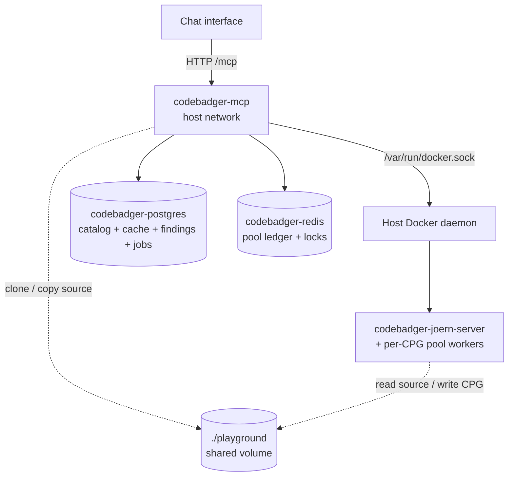
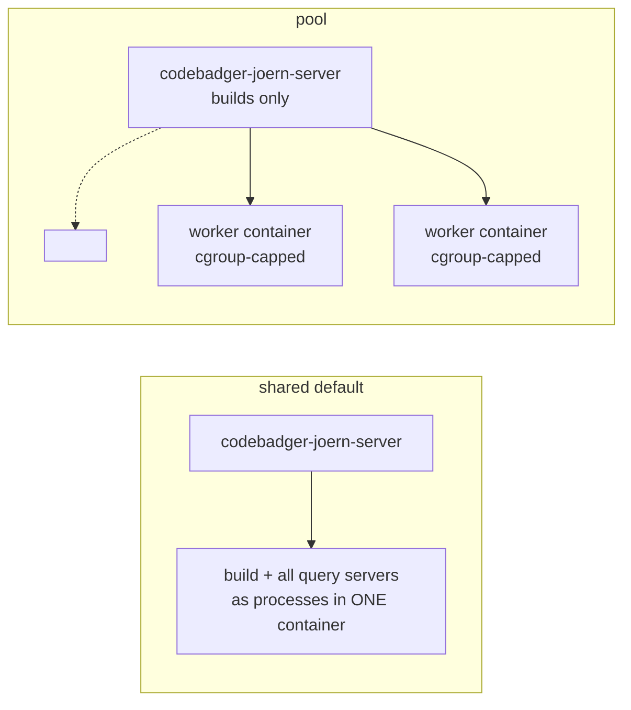

# Deployment

The whole stack — the **MCP server**, the **Joern** container, **Postgres**, and
**Redis** — runs from a single `docker compose`. The MCP server runs in its own
container (`Dockerfile.mcp`) and drives the host Docker daemon to build CPGs and
spawn per-CPG Joern workers.



## Prerequisites

- **Docker Engine** + the **Compose v2 plugin** (`docker compose version`). Install: <https://docs.docker.com/engine/install/>.
- Permission to use the Docker socket (the deploy user is in the `docker` group, or runs as root). The MCP container drives the host daemon via `/var/run/docker.sock`.
- **A host dedicated to codebadger.** Mounting the Docker socket gives the MCP container root-equivalent control of the host (see the trust-boundary note below).
- Disk for the `playground/` volume (cloned sources + CPG `.bin` caches can reach tens of GB) and RAM for the Joern JVMs (see [Sizing](#sizing-for-your-host)).
- `git` is only needed if you clone this repo to the host; everything else runs in containers.

## Quick start (full stack)

```bash
# 1. Get the code
git clone http://github.com/lekssays/codebadger && cd codebadger

# 2. Configure for your host: copy the template and edit
cp .env.example .env
#   Set at minimum:
#     PLAYGROUND_HOST_PATH=/abs/path/to/codebadger/playground   # ABSOLUTE
#     MCP_HOST=0.0.0.0                                           # or 127.0.0.1 behind a proxy
#   Size memory for your host (RAM is the binding constraint):
python scripts/recommend_config.py        # prints JOERN_MEM_LIMIT / JOERN_MEMORY_BUDGET_MB to set

# 3. Build images + start everything + wait for /health
./scripts/deploy.sh

# 4. Confirm it's serving
./scripts/deploy.sh status
```

`docker compose` auto-loads `.env`, so once it's filled in, plain `docker compose
up -d` works too. `deploy.sh` additionally exports an **absolute**
`PLAYGROUND_HOST_PATH` (pool workers are started by the host daemon, so their
`playground` bind-mount source must be host-absolute) and waits for `/health`.

To run Compose directly without the script, just make sure that path is absolute:

```bash
PLAYGROUND_HOST_PATH="$PWD/playground" docker compose up -d --build
```

The MCP container uses **host networking** and mounts the Docker socket, so the
`localhost:<published-port>` wiring (Joern servers, Postgres `55432`, Redis
`56379`, and the MCP's own `:4242`) works unchanged.

> **Trust boundary:** mounting `/var/run/docker.sock` gives the MCP container
> root-equivalent control of the host. Run it on a host dedicated to codebadger.
> Host networking is required by the published-port + sibling-container model.

### Verify it's healthy

`GET /health` reports `status` (`up`/`partial`/`down`), `mcp: "codebadger"`, and a
`dependencies` map (joern, postgres, redis, docker, cpg_queue). It returns HTTP
200 for `up`/`partial` and 503 for `down`, so it works directly as an
orchestrator liveness/readiness probe.

```bash
curl -s http://localhost:4242/health | python -m json.tool
# -> {"status":"up","mcp":"codebadger","dependencies":{"joern":"up","postgres":"up",...}}
```

> Postgres publishes on **55432** and Redis on **56379** (non-default ports) to
> avoid clashing with system services; override with `POSTGRES_PORT` / `REDIS_PORT`.

## Day-2 operations

```bash
./scripts/deploy.sh status     # docker compose ps + /health
./scripts/deploy.sh logs       # follow the MCP logs (add a service name for others)
./scripts/deploy.sh restart    # recreate just the MCP container, re-wait for health
./scripts/deploy.sh down       # stop & remove the stack (playground + pgdata persist)

# Apply code/config changes (rebuilds the MCP image, recreates changed containers):
./scripts/deploy.sh            # = docker compose up -d --build
```

- **State that survives `down`:** `playground/` (sources + CPG caches) and
  `pgdata/` (the Postgres catalog/cache/findings/jobs) are bind-mounted, so the
  catalog and generated CPGs persist across restarts and upgrades. `pgdata/` is
  kept **outside** `playground/` on purpose — the Joern containers mount the whole
  playground, so the database files must live elsewhere (see
  [Security](security.md)). Override its location with `POSTGRES_DATA_PATH`. Redis
  is ephemeral by design (the pool ledger rebuilds).
- **Back up** `playground/` (especially `playground/cpgs`) and `pgdata/`; put them
  on fast storage.
- **Per-run logs** are written under `./logs/` (`codebadger-<ts>-<pid>.log`, plus a
  `codebadger-latest.log` symlink) in addition to `docker compose logs`.

## Analyzing code from a chat interface

A user pastes a GitHub URL, a local path, **or a code snippet**; everything is
staged under `playground/` so all containers can see it.

- **GitHub repo** — pass the URL to `generate_cpg` (`source_type="github"`). The
  MCP clones it into `playground/codebases/<hash>` automatically; nothing else to
  set up.
- **Local source** — place the code under `./playground/` on the host (the MCP
  sees it at `/app/playground/...`) and pass that path with `source_type="local"`,
  e.g. `/app/playground/myproject`. The MCP copies it into
  `playground/codebases/<hash>`. A path that isn't visible inside the MCP
  container is rejected, so local code must live under `playground`.
- **Pasted snippet** — pass `source_type="snippet"` with the code in `code` (and
  the `language`); no repo or path needed. The MCP writes it to
  `playground/codebases/<hash>/snippet.<ext>` (override the name with `filename`)
  and builds a CPG from it like any other source. The cache key is the snippet's
  content hash, so re-pasting the same code reuses the existing CPG.

CPGs are written to `playground/cpgs/<hash>` and cached there, so re-analysis and
sleeping/auto-wake are cheap. The `./playground` volume is the durable artifact —
back it up / put it on fast storage.

### Hardening a chat-facing deployment (`CHAT_DEPLOY`)

The three source types above are not equally safe to expose. `source_type="local"`
lets the caller name a host path; on a chat-facing or multi-user MCP that is an
arbitrary-host-path read primitive you almost certainly don't want. Set:

```bash
CHAT_DEPLOY=true     # in .env (passed through to the container by compose)
```

With `CHAT_DEPLOY=true` the MCP **refuses `source_type="local"`** and returns a
message steering the caller to the safe inputs. What remains:

- **Git repos** — only `https://github.com/…` and `https://gitlab.com/…` are
  accepted. The URL is checked twice (a literal `https://<host>/` prefix *and* a
  parsed-hostname allowlist) and rejects other hosts, non-`https` schemes
  (`git://`, `ssh://`, `file://`), embedded credentials, ports, and look-alike
  domains — so a repo URL can't be turned into an SSRF probe.
- **Pasted snippets** — `source_type="snippet"` with the code in a
  `<code language="…">` tag; the language is validated/inferred and a mislabeled
  or ambiguous snippet is refused. Nothing touches the host filesystem.

Leave `CHAT_DEPLOY=false` (the default) only on a **trusted, single-tenant** host
that intentionally builds CPGs from local checkouts. There you can additionally
pin `ALLOWED_SOURCE_ROOTS` to hard-contain local sources to specific directories
**as the MCP sees them** — inside the container that is under `/app/playground`,
so e.g. `ALLOWED_SOURCE_ROOTS=/app/playground`. Any local path that doesn't
canonically resolve under an allowed root (after symlink resolution) is rejected.

`CHAT_DEPLOY` is **not** a substitute for the host boundary: it removes the
local-path vector, but the MCP still holds the Docker socket and there's no
cross-CPG access control between callers. See
[Security](security.md) for the full picture — front the MCP with auth and treat
one deployment as one trust domain.

## Running the MCP on the host (development)

To iterate on the server itself, run the backing services in Compose and the MCP
on the host (skip the MCP container with `--scale codebadger-mcp=0`):

```bash
docker compose up -d --scale codebadger-mcp=0   # Joern + Postgres + Redis only
python main.py                                   # defaults to the Compose services
```

It defaults to the Compose Postgres/Redis and creates the Postgres schema on first
start. Override `DATABASE_URL` / `REDIS_URL` to point at managed instances.

## Configuration reference

Every value below is an environment variable. Precedence is **env var > `config.yaml`
> built-in default** (`src/defaults.py`); `docker compose` and `scripts/deploy.sh`
auto-load `.env` for `${VAR}` interpolation. Defaults shown are the built-in
defaults — note a few differ in the shipped `docker-compose.yml` (called out below).

> A host-run `python main.py` reads `config.yaml`, **not** `.env` — export the vars
> in that shell (or use the containerized MCP, which gets them from compose).

### Server & networking

| Variable | Default | Description |
|---|---|---|
| `MCP_HOST` | `127.0.0.1` (compose: `0.0.0.0`) | Interface the MCP binds. `127.0.0.1` = loopback only (behind a proxy). |
| `MCP_PORT` | `4242` | Port the MCP HTTP server listens on (also the host port — host networking). |
| `MCP_LOG_LEVEL` | `INFO` | Log level. |
| `MAX_MCP_CONNECTIONS` | `16` | Max in-flight HTTP requests; the MCP returns `503` past this. |
| `LOG_DIR` | `logs` | Per-run log directory. |
| `LOG_TO_FILE` | `true` | Also write a rotated per-run file in addition to stdout. |
| `LOG_MAX_BYTES` | `52428800` (50 MB) | Per-file rotation cap. |
| `LOG_BACKUP_COUNT` | `5` | Rotated backups kept per run file. |

### Deployment posture & source security

| Variable | Default | Description |
|---|---|---|
| `CHAT_DEPLOY` | `false` | `true` DISABLES `source_type='local'` so a chat-facing MCP can't read arbitrary host paths (see [Hardening](#hardening-a-chat-facing-deployment-chat_deploy)). |
| `ALLOWED_SOURCE_ROOTS` | `` (empty) | `:`-separated allowlist of dirs local sources must canonically resolve within (as the MCP sees them, e.g. `/app/playground`). Empty = no allowlist. |
| `GITHUB_TOKEN` | `` (empty) | PAT for cloning private repos (never embed it in the URL). |

### Memory & the Joern pool

Three distinct memory knobs, easy to confuse — keep them straight:

- **`JOERN_MEM_LIMIT`** — the **container** cap (`docker-compose mem_limit`) for
  `codebadger-joern-server`, also read by the MCP's over-commit guard.
- **`JOERN_MEMORY_BUDGET_MB`** — the **query-worker pool** budget (a reservation
  ledger across all query servers); the pool admits/evicts to stay under it.
- **`JOERN_JAVA_OPTS` (`-Xmx`)** — a **single query server's** JVM heap.

`JOERN_MEM_LIMIT` and `JOERN_MEMORY_BUDGET_MB` are the two you must size together —
run `python scripts/recommend_config.py` for your host.

| Variable | Default | Description |
|---|---|---|
| `JOERN_MEM_LIMIT` | compose: `100g` | **Caps the `codebadger-joern-server` container** (`mem_limit`) **and** is read by the MCP's over-commit guard. In `pool` mode this is the **build** container only; in `shared` mode it's the whole Joern budget (builds + query servers). MUST match the container cap. The single most important memory knob for compose. |
| `JOERN_MEMORY_BUDGET_MB` | `0` (auto) | Query-worker pool memory ledger (MB); the pool admits/evicts servers to stay under it. `0` = auto-derive from host RAM at startup. Pool-mode invariant: `JOERN_MEM_LIMIT + JOERN_MEMORY_BUDGET_MB` ≤ Joern budget. |
| `JOERN_RSS_EVICTION_THRESHOLD_MB` | `0` (auto) | LRU-evict when container RSS exceeds this (backstop on the reservation ledger). `0` = auto. |
| `JOERN_JAVA_OPTS` | `-Xmx4G -Xms2G …` | Per query-server JVM opts; **`-Xmx` is the real per-server heap** (the pool also sizes `-Xmx` per CPG tier at runtime). Not to be confused with `JOERN_MEM_LIMIT`, which is the *container* cap. |
| `MAX_ACTIVE_JOERN_SERVERS` | `16` | Safety ceiling on concurrent query servers (the memory budget is the real limiter). |
| `JOERN_IDLE_TTL_SECONDS` | `600` | Idle query worker offloaded after this many seconds (CPG → SLEEPING; reactivates on next query). `0` = off. |
| `JOERN_REAPER_INTERVAL_SECONDS` | `60` | How often the idle reaper scans. |
| `JOERN_WORKER_MODE` | `shared` (compose: `pool`) | `shared` = query servers as processes in the build container; `pool` = each CPG in its own cgroup-capped container. |
| `JOERN_WORKER_IMAGE` | `codebadger-joern-server:latest` | Image for per-CPG pool workers. |
| `JOERN_WORKER_INTERNAL_PORT` | `8080` | Port Joern binds inside each pool worker container. |
| `JOERN_WORKER_PORT_MIN` / `JOERN_WORKER_PORT_MAX` | `14000` / `14999` | Host port range for pool workers (must be disjoint from `JOERN_PORT_*`). |
| `JOERN_PORT_MIN` / `JOERN_PORT_MAX` | `13371` / `13870` | Host port range the shared joern-server container publishes. |
| `JOERN_SERVER_STARTUP_TIMEOUT` | `300` | Seconds to wait for a Joern server to come up. |
| `JOERN_PLAYGROUND_HOST_PATH` | `` (auto-derive) | Absolute HOST playground path bind-mounted into pool workers. Compose passes `PLAYGROUND_HOST_PATH` through to this. Empty = derive from app location (only correct when the MCP runs on the host, not in a container). |
| `JOERN_BINARY_PATH` | `joern` | Joern CLI binary path. |

### CPG generation & queue

| Variable | Default | Description |
|---|---|---|
| `CPG_BUILD_WORKERS` | `4` (compose: `4`) | Concurrent CPG builds. INVARIANT: `CPG_BUILD_WORKERS × CPG_BUILD_HEAP_GB` ≤ `JOERN_MEM_LIMIT`. |
| `CPG_BUILD_HEAP_GB` | `6` | Per-build frontend heap (GB). Without it the JVM defaults to ~25% of the container cap and N builds can OOM the host. |
| `CPG_GENERATION_TIMEOUT` | `1800` | CPG build timeout (s); large C/C++ trees exceed 10 min. |
| `CPG_QUEUE_BACKEND` | `durable` | `durable` = Postgres jobs table (survives restart, dedup + backpressure); `memory` = in-process (lost on restart). |
| `CPG_QUEUE_MAXSIZE` | `64` | Pending-job waiting room (deduped Postgres rows, no RAM cost). Too small → `queue_full` rejections under high concurrency. |
| `MAX_REPO_SIZE_MB` | `1024` | Pre-build source-size ceiling. |
| `CPG_LARGE_PROJECT_GUARD` | `true` | `generate_cpg` returns `large_project_warning` for a local source over the thresholds unless `force=True`. Set `false` for unattended/batch drivers. |
| `CPG_LARGE_PROJECT_MAX_MB` | `2000` | Guard size threshold (MB). |
| `CPG_LARGE_PROJECT_MAX_LOC` | `2000000` | Guard lines-of-code threshold. |
| `OUTPUT_TRUNCATION_LENGTH` | `2000` | Default output truncation length. |

### Query

| Variable | Default | Description |
|---|---|---|
| `QUERY_TIMEOUT` | `300` | Per-query timeout (s); also the hard cap on caller-supplied timeouts. |
| `QUERY_CACHE_ENABLED` | `true` | Cache tool outputs. |
| `QUERY_CACHE_TTL` | `300` | Cache TTL (s). |

### Backing services & Docker

| Variable | Default | Description |
|---|---|---|
| `DATABASE_URL` | built from `POSTGRES_*` | Full Postgres URL override. |
| `POSTGRES_HOST` / `POSTGRES_PORT` | `localhost` / `55432` | Compose publishes Postgres on `POSTGRES_PORT` (non-default to avoid clashing with a system Postgres). |
| `POSTGRES_USER` / `POSTGRES_PASSWORD` / `POSTGRES_DB` | `codebadger` (each) | Postgres credentials/db. |
| `POSTGRES_DATA_PATH` | `./pgdata` | Host path for Postgres data — kept OUTSIDE the playground on purpose (see [Security](security.md)). |
| `REDIS_URL` | built from `REDIS_*` | Full Redis URL override. |
| `REDIS_HOST` / `REDIS_PORT` / `REDIS_DB` | `localhost` / `56379` / `0` | Redis connection. |
| `PLAYGROUND_HOST_PATH` | `./playground` | ABSOLUTE host playground path (sources + CPG caches); compose mounts it and passes it to `JOERN_PLAYGROUND_HOST_PATH`. `scripts/deploy.sh` sets it automatically. |
| `DOCKER_HOST` | `unix:///var/run/docker.sock` | Daemon the MCP drives. `scripts/deploy.sh` derives `DOCKER_SOCK` from it to bind-mount the (possibly rootless) socket. |

### Storage & telemetry

| Variable | Default | Description |
|---|---|---|
| `WORKSPACE_ROOT` | `/tmp/codebadger` | Server workspace root. |
| `CLEANUP_ON_SHUTDOWN` | `true` | Clean the workspace on shutdown. |
| `OTEL_ENABLED` | `false` | Enable OpenTelemetry export. |
| `OTEL_SERVICE_NAME` | `codebadger` | OTEL service name. |
| `OTEL_EXPORTER_OTLP_ENDPOINT` | `http://localhost:4317` | OTLP collector endpoint. |
| `OTEL_EXPORTER_OTLP_PROTOCOL` | `grpc` | OTLP protocol (`grpc` or `http`). |

### Startup tuning

| Variable | Default | Description |
|---|---|---|
| `RECOMMEND_ON_STARTUP` | `true` | Log the memory-aware recommendation block at startup. |
| `AUTO_TUNE_MEMORY` | `true` | Auto-derive `JOERN_MEMORY_BUDGET_MB` / RSS threshold from host RAM when they're `0`. |

## Sizing for your host

RAM, not CPU, is the binding constraint - each Joern server is a JVM with its own
heap. Print the memory-aware recommendation before launching:

```bash
python scripts/recommend_config.py                       # autodetect this host
python scripts/recommend_config.py --compare config.yaml # flag risky drift
python scripts/recommend_config.py --worker-mode pool    # values for pool mode
python scripts/recommend_config.py --mem 256 --cores 96  # plan another host
```

The same block logs at startup (disable with `RECOMMEND_ON_STARTUP=false`). The
model reserves ~15% of RAM for OS/Docker/DB, splits the rest between a
CPG-generation reserve and a query pool, and sizes concurrency so heaps fit the
query budget. Leave `memory_budget_mb` / `rss_eviction_threshold_mb` at `0` to
auto-derive.

### CPG size tiers

`importCpg` runs overlay passes that need roughly as much RAM as the CPG `.bin`
is large. The scheduler sizes each server's heap to the CPG's tier:

| Tier | CPG `.bin` | Heap (`-Xmx`) | Reserve | Example |
|------|-----------|---------------|---------|---------|
| S | ≤ 1 GB | 2 GB | 3 GB | libsoup, small libxml2 modules |
| M | ≤ 4 GB | 6 GB | 8 GB | ImageMagick, php, wireshark dissectors |
| L | ≤ 12 GB | 16 GB | 20 GB | full wireshark, large php |
| XL | > 12 GB | 28 GB | 32 GB | v8 (keep 1–2 concurrent) |

## `shared` vs `pool` mode

`JOERN_WORKER_MODE` controls where query servers run:



- **`shared`** (default) - every query server is a process inside the single
  `codebadger-joern-server` container. Set its `mem_limit` to the whole Joern budget.
- **`pool`** - each CPG's query server runs in its **own cgroup-capped container**,
  so an OOM kills just that worker, not every server. Here the
  `codebadger-joern-server` container *only builds* CPGs, so cap it at the **build
  reserve** and let the worker pool use the rest via `memory_budget_mb`.

> **Pool-mode invariant:** `build container mem_limit + memory_budget_mb ≤ Joern
> budget`. If the build container is left at the full budget, the startup guard
> clamps the worker budget (and warns) to prevent host over-commit - so set
> `JOERN_MEM_LIMIT` to the build reserve (e.g. `30g`) in **both** `docker-compose`
> and the manager's environment. `main.py` does not read `.env`.

Pool state (reservation ledger, warm-worker registry, global LRU, per-CPG spawn
lock) lives in Redis when `REDIS_URL` is set, so multiple processes coordinate
spawn/eviction without over-committing - and any process can serve a CPG another
started. See [Architecture → Memory-aware admission](architecture.md#memory-aware-admission).

## Scaling: large batches

Driving hundreds of CPGs (e.g. a CVE corpus):

- **Use the durable queue:** `CPG_QUEUE_BACKEND=durable` (DB-backed jobs table)
  survives restarts, dedups, and applies backpressure instead of silently dropping.
  Put it on Postgres for multi-process operation.
- **Handle backpressure:** `generate_cpg` returns `queue_full` when saturated and
  the HTTP layer returns `503` past `MAX_MCP_CONNECTIONS`. Your driver must
  **retry** and **poll `get_cpg_status`**, not fire everything at once.
- **Generate ahead, query on demand:** pre-build the set, then query. Idle servers
  sleep and wake on demand, so you don't pay generation and query memory at once.
- **Cap the container:** always set a `mem_limit` on `codebadger-joern-server` so a
  runaway analysis can't take down the host.

### Large repositories

For huge codebases, analyze a **sub-component** (e.g. `/path/to/v8/src/parsing`)
rather than the repo root. Default exclusion patterns already skip tests, docs,
vendored deps, and build output. Raise `CPG_GENERATION_TIMEOUT` for the very
largest frontends.
