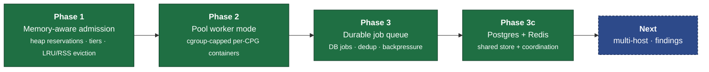

# Roadmap

The scalability work landed in phases, each removing a ceiling that capped how
many codebases codebadger could analyze at once. This page records what shipped
and the direction ahead.

## Shipped

| Phase | What it solved |
|-------|----------------|
| **1 - Memory-aware admission** | Replaced a fixed server count with a RAM **budget**: heaps are sized to each CPG's tier (S/M/L/XL), and LRU + an RSS backstop evict before the host OOMs. A batch of small CPGs now runs far more servers than a few large ones. |
| **2 - Pool worker mode** | `JOERN_WORKER_MODE=pool` runs each CPG's query server in its own cgroup-capped container, so an OOM kills one worker instead of cascading across every server. |
| **3 - Durable job queue** | A DB-backed jobs table replaces the lossy in-memory queue: survives restarts, dedups (one active job per CPG), and applies real backpressure (`FOR UPDATE SKIP LOCKED`) instead of silently dropping. |
| **3c - Postgres + Redis** | Moved catalog, cache, findings, and the queue into one Postgres, with pool state and locks in Redis - enabling multiple API/scheduler processes to share one budget, catalog, and queue. |

See [Architecture](architecture.md) for how these fit together and
[Deployment](deployment.md) for how to operate them.

## In progress / next

> Direction, not commitments - priorities shift with research needs.

- **Multi-host scheduling.** Spread the worker pool across machines, coordinated
  through the shared Postgres + Redis state.
- **Findings as first-class data.** Surface the persisted `findings` store through
  tools (query, dedup, and track results across runs).
- **More detectors.** Broader language- and domain-specific coverage, contributed
  via [Custom Tools](custom-tools.md).

Have a use case that hits a wall? Open an issue describing the workload - the
phases above were all driven by concrete batch-analysis pain.
