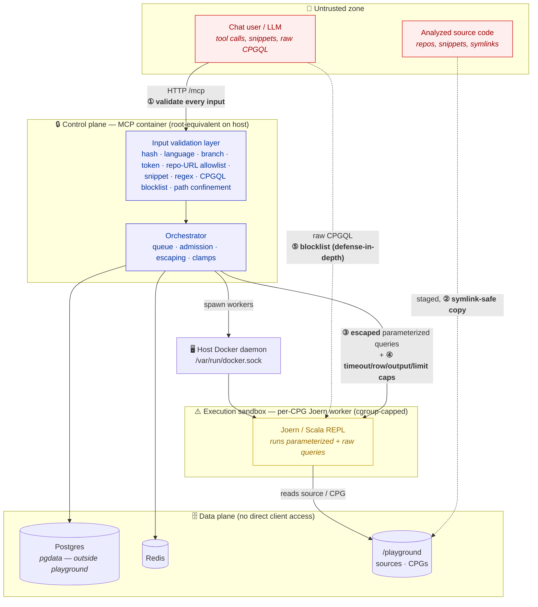
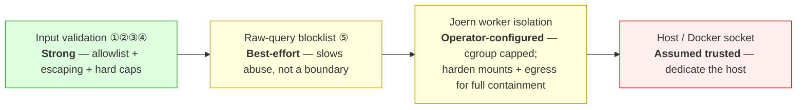

# 🦡 codebadger Security

codebadger runs an LLM-driven analysis engine over **untrusted source code** and
exposes **untrusted, model-generated input** to a Joern (Scala REPL) backend. This
page states the threat model, the controls codebadger provides, and — just as
important — the risks it does **not** remove so an operator can deploy it safely.

> **One-line posture:** codebadger is hardened against malicious *tool input* and
> malicious *analyzed code*, but it is designed to run on a **single-tenant host
> dedicated to codebadger**. Mounting the Docker socket gives the MCP
> root-equivalent control of that host, and the raw-query escape hatch can execute
> code inside the Joern container — so the host boundary and the Joern sandbox are
> the controls that matter most in production.

## Who/what we trust

| Actor / component | Trust level | Why |
|---|---|---|
| **Operator / devops** | Trusted | Runs `deploy.sh`, owns the host and the Docker socket. |
| **Chat user + the LLM** | **Untrusted input** | Anything they send (paths, URLs, snippets, queries, regexes, hashes) is attacker-controlled and validated at the boundary. |
| **Analyzed source code** | **Untrusted data** | Repos/snippets may be adversarial (e.g. planted symlinks, pathological regex bait). |
| **MCP server** | Trusted control plane | Validates input, orchestrates, holds DB/Redis creds. Has the Docker socket (root-equivalent on the host). |
| **Joern workers** | **Semi-trusted execution** | Run queries derived from untrusted input. Isolated per-CPG in cgroup-capped containers, but see the shared `/playground`. |
| **Postgres / Redis** | Trusted data plane | Catalog, cache, findings, jobs, pool ledger. No direct client access; DB files kept outside the playground. |

## Trust boundaries (threat model)

The numbered controls are the boundary checks; each is described below.

## Controls we provide

| # | Boundary | Control | Where |
|---|----------|---------|-------|
| ① | Tool input → MCP | **Allowlist/format validation of every parameter**: `source_type`, `language` (whitelist), `codebase_hash` (`^[a-f0-9]{16}$`), `github_token` & `branch` (anti URL-/arg-injection, e.g. blocks `--upload-pack`), snippet `code`/`filename`/label, regex `pattern` (length + ReDoS shapes). | `src/utils/validators.py` |
| ①a | Repo URL → clone (**SSRF/undefined-clone prevention**) | **Strict allowlist on remote repos**: only `https://github.com/` or `https://gitlab.com/` (incl. `www.`). Enforced by **two independent gates** — a literal, case-sensitive `https://<host>/` prefix match *and* a parsed-`hostname` allowlist — plus rejection of any non-`https` scheme (`git://`, `ssh://`, `file://`, …), embedded credentials (`user:tok@`), non-default ports, and whitespace/control chars. Blocks userinfo host-smuggling (`https://github.com@evil/…`), internal/metadata hosts, and look-alike domains. | `validators.py` (`validate_repo_url`) |
| ①b | Snippet code → CPG | **Language validated *and* inferred.** Pasted code is supplied in `<code language="…">` tags (parsed by regex); the declared language must be supported, and a content-signal check **refuses an obviously mislabeled tag** or **ambiguous/undeclared** language — every refusal returns an actionable message rather than building a wrong-language CPG. | `validators.py` (`parse_snippet_blocks`, `validate_and_infer_snippet_language`) |
| ② | Source staging | **Path confinement + symlink-safe copy.** Local paths must be absolute, are rejected if they contain null bytes/control chars, then `realpath`-canonicalized (collapsing `..` and resolving symlinks *before* any check) and screened against a system-dir denylist (`/etc`, `/proc`, `/sys`, `/root`, …). An optional `ALLOWED_SOURCE_ROOTS` allowlist hard-contains local sources to named roots. Snapshot reads confined with `realpath`+prefix / `commonpath`; the copy never dereferences symlinks whose target escapes the source tree. | `validators.py` (`resolve_host_path`), `core_tools.py` |
| ②a | Deployment posture | **`CHAT_DEPLOY=true` disables `source_type='local'` entirely** so a chat-facing / multi-tenant MCP cannot read arbitrary host paths — callers must use an allowlisted repo URL or a pasted snippet. | `core_tools.py`, `config.py` |
| ③ | Parameterized queries → Joern | **Scala string-literal escaping** (`escape_scala_string`, applied at every template/query site) so method names, filters, file names, etc. cannot break out of the query and inject code. Numeric params are int-cast. | `src/utils/query_rendering.py` |
| ④ | Query execution | **Resource caps**: timeout ≤ 300 s, ≤ 10 000 rows, ≤ 5 MB output (visible `truncated` flag, never silent), ≤ 5 000-line snippet spans, and caller-supplied `limit`/`take(n)`/`depth` clamped at the query loader. A timed-out query kills the JVM and the CPG auto-wakes on the next call. | `query_executor.py`, `tools/queries/__init__.py` |
| ⑤ | Raw CPGQL escape hatch | **Denylist on `run_cpgql_query`**, always enforced, blocking process exec, file read/write, network, dynamic dependency load, reflection. **Defense-in-depth, not a boundary** (see below). | `validators.py`, `code_browsing_tools.py` |
| — | Deletion | `remove_cpg` validates the hash and asserts the target stays under `playground/` before any `rmtree`. | `core_tools.py` |
| — | Output | Joern stderr / exceptions are **path-redacted** before reaching the client (no host-path/classpath disclosure). | `validators.py`, `query_executor.py` |

### How strong is each layer?

## What we do NOT protect against (non-goals & residual risk)

1. **The MCP container is root-equivalent on the host.** It mounts
   `/var/run/docker.sock` (Docker-out-of-Docker) and uses host networking. Treat the
   MCP as having root on the host and **run it on a dedicated host**. See
   [Deployment → Trust boundary](deployment.md#quick-start-full-stack).
2. **`run_cpgql_query` can execute code inside the Joern container.** The Joern
   engine is a full Scala interpreter; the ⑤ denylist stops casual/accidental abuse
   but a determined attacker can obfuscate around literal patterns. Code that runs
   there can read the **shared `/playground`** — which includes *all* tenants'
   sources and CPGs (the database files are **no longer** reachable: `pgdata` lives
   outside the playground by default) — and reach the network. The real containment
   is the worker sandbox (see hardening checklist). If you expose codebadger to
   untrusted chat, either sandbox Joern as below or disable the raw-query tool.
3. **No built-in authentication/authorization.** The MCP HTTP endpoint (`:4242`) has
   no auth of its own. Put it behind a reverse proxy / network policy; never expose
   it directly to untrusted networks.
4. **Single-tenant by design.** There is no per-user isolation between codebases
   inside one deployment — anyone who can call the API can read any CPG/source it has
   staged. `CHAT_DEPLOY=true` removes the *arbitrary-host-path* vector (it disables
   `source_type='local'`), but it does **not** add cross-CPG access control between
   callers; treat one deployment as one trust domain.
5. **Denial-of-service is bounded, not eliminated.** Caps and timeouts prevent
   unbounded resource use per call, but a flood of expensive analyses can still
   saturate the host; use the queue backpressure (`queue_full`/`503`) and rate-limit
   upstream.

## Production hardening checklist

- [ ] **Dedicate the host** to codebadger (Docker socket = host root).
- [ ] **Front the MCP with auth** (reverse proxy / mTLS / network policy); bind
      `MCP_HOST=127.0.0.1` behind it.
- [ ] **For a chat-facing / untrusted deployment, set `CHAT_DEPLOY=true`** so
      `source_type='local'` is disabled (no arbitrary host-path access; only
      allowlisted repo URLs and pasted snippets). On a trusted batch host that
      builds from local checkouts, leave it false and optionally pin
      `ALLOWED_SOURCE_ROOTS` to the dirs you actually build from.
- [ ] **Sandbox the Joern workers**: deny outbound network egress, and mount only
      the CPG/source each worker needs rather than the whole `/playground`.
- [x] **Keep `pgdata` outside the Joern-visible mount** — done by default (the
      Postgres data dir is `./pgdata`, a sibling of `playground/`; relocate with
      `POSTGRES_DATA_PATH`). A Joern query can no longer reach the database files.
- [ ] **Disable or gate `run_cpgql_query`** for untrusted callers if you don't need
      the raw escape hatch.
- [ ] **Keep memory caps set** (`JOERN_MEM_LIMIT` + `JOERN_MEMORY_BUDGET_MB`) so a
      runaway analysis can't OOM the host — see [Deployment → Sizing](deployment.md#sizing-for-your-host).
- [ ] **Use a private GitHub token** with least privilege; it is validated, injected
      transiently, and stripped from `.git/config` after clone.

## Reporting a vulnerability

Found a security issue in codebadger itself (not a finding produced by the tools)?
Please report it privately — email **ahmed [at] lekssays [dot] com** — rather than
opening a public issue. Include reproduction steps and the affected version/commit.
