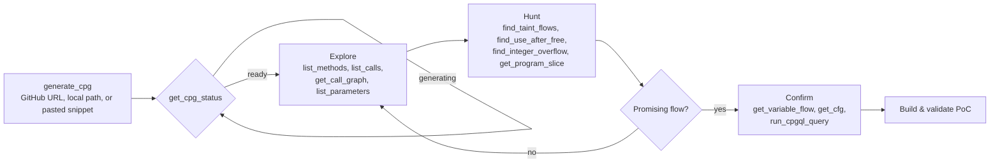

# Usage

## Connect an MCP client

codebadger speaks MCP over HTTP at `http://localhost:4242/mcp`.

**VS Code / GitHub Copilot** - `~/.config/Code/User/mcp.json`:

```json
{
  "servers": {
    "codebadger": { "url": "http://localhost:4242/mcp", "type": "http" }
  }
}
```

**Claude Desktop / Claude Code** - `claude_desktop_config.json`:

```json
{
  "mcpServers": {
    "codebadger": { "url": "http://localhost:4242/mcp", "type": "http" }
  }
}
```

## Researcher workflow



`generate_cpg` returns immediately and builds in the background - **poll
`get_cpg_status` until `ready`** rather than blocking. CPGs are cached on disk by
content hash; an idle server sleeps and transparently wakes on the next query.

## Example session

```text
# 1. Build a CPG (GitHub URL or local path; a sub-path keeps it small/fast)
generate_cpg(source_type="github", source_path="https://github.com/GNOME/libsoup", language="c")
  -> { "codebase_hash": "ddf44eb0a10a85e6", "status": "generating" }

# 1b. Or analyze code pasted straight into the chat - no repo or path needed
generate_cpg(source_type="snippet", language="c",
             code="int main() { char b[8]; gets(b); return 0; }")
  -> { "codebase_hash": "9f2c1ab07e4d3a55", "status": "generating" }

# 2. Wait for it
get_cpg_status(codebase_hash="ddf44eb0a10a85e6")  -> { "status": "ready" }

# 3. Orient
list_methods(codebase_hash="ddf44eb0a10a85e6", name_filter=".*parse.*")
get_call_graph(codebase_hash="ddf44eb0a10a85e6", method_name="soup_header_parse")

# 4. Hunt
find_taint_flows(codebase_hash="ddf44eb0a10a85e6")
find_integer_overflow(codebase_hash="ddf44eb0a10a85e6")

# 5. Drill into a candidate (read source from your own checkout, or pull node .code)
run_cpgql_query(codebase_hash="ddf44eb0a10a85e6",
                query="cpg.method.name(\"soup_header_parse\").code.l")
get_program_slice(codebase_hash="ddf44eb0a10a85e6", ...)

# 6. Escape hatch - raw CPGQL for anything the tools don't cover
run_cpgql_query(codebase_hash="ddf44eb0a10a85e6",
                query="cpg.call.name(\"memcpy\").l")
```

> Large repos (v8, full wireshark): pass a **sub-component path** instead of the
> repo root. `generate_cpg` warns past ~15k LOC / 150 MB and needs `force=True`
> for the full tree. See [Deployment → Large repositories](deployment.md#large-repositories).

## Tool catalog

Every analysis capability is an MCP tool, grouped into CPG lifecycle, code
browsing, semantic analysis, taint/slicing, and vulnerability detectors. For the
full list with a description of each, see **[Available Tools](available-tools.md)**.

Need a detector that isn't there? Add one in minutes - see [Custom Tools](custom-tools.md).
