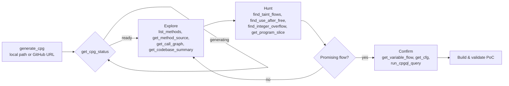

# Usage

## Connect an MCP client

codebadger speaks MCP over HTTP at `http://localhost:4242/mcp`.

**VS Code / GitHub Copilot** - `~/.config/Code/User/mcp.json`:

```json
{
  "servers": {
    "codebadger": { "url": "http://localhost:4242/mcp", "type": "http" }
  }
}
```

**Claude Desktop / Claude Code** - `claude_desktop_config.json`:

```json
{
  "mcpServers": {
    "codebadger": { "url": "http://localhost:4242/mcp", "type": "http" }
  }
}
```

## Researcher workflow



`generate_cpg` returns immediately and builds in the background - **poll
`get_cpg_status` until `ready`** rather than blocking. CPGs are cached on disk by
content hash; an idle server sleeps and transparently wakes on the next query.

## Example session

```text
# 1. Build a CPG (GitHub URL or local path; a sub-path keeps it small/fast)
generate_cpg(source="https://github.com/GNOME/libsoup", language="c")
  -> { "codebase_hash": "ddf44eb0a10a85e6", "status": "generating" }

# 2. Wait for it
get_cpg_status(codebase_hash="ddf44eb0a10a85e6")  -> { "status": "ready" }

# 3. Orient
get_codebase_summary(codebase_hash="ddf44eb0a10a85e6")
list_methods(codebase_hash="ddf44eb0a10a85e6", name_filter=".*parse.*")

# 4. Hunt
find_taint_flows(codebase_hash="ddf44eb0a10a85e6")
find_integer_overflow(codebase_hash="ddf44eb0a10a85e6")

# 5. Drill into a candidate
get_method_source(codebase_hash="ddf44eb0a10a85e6", method_name="soup_header_parse")
get_program_slice(codebase_hash="ddf44eb0a10a85e6", ...)

# 6. Escape hatch - raw CPGQL for anything the tools don't cover
run_cpgql_query(codebase_hash="ddf44eb0a10a85e6",
                query="cpg.call.name(\"memcpy\").l")
```

> Large repos (v8, full wireshark): pass a **sub-component path** instead of the
> repo root. `generate_cpg` warns past ~15k LOC / 150 MB and needs `force=True`
> for the full tree. See [Deployment → Large repositories](deployment.md#large-repositories).

## Tool catalog

### Core
- `generate_cpg` - build a CPG for a codebase (local path or GitHub URL).
- `get_cpg_status` - check whether a CPG exists and its status.
- `run_cpgql_query` - execute a raw CPGQL query, returns structured results.
- `get_cpgql_syntax_help` - CPGQL syntax helpers and common error fixes.

### Code browsing
- `list_methods`, `list_files`, `get_method_source`, `list_calls`,
  `get_call_graph`, `list_parameters`, `get_codebase_summary`, `get_code_snippet`.

### Semantic analysis
- `get_cfg` - control-flow graph for a method.
- `get_type_definition` - struct/class members.
- `get_macro_expansion` - heuristically detect macro-expanded calls.

### Taint & vulnerability analysis
- `find_taint_sources`, `find_taint_sinks`, `find_taint_flows` - data-flow taint analysis.
- `get_program_slice`, `get_variable_flow` - slicing and data-dependency tracing.
- `find_bounds_checks` - bounds-checks near a buffer access.
- Memory-safety detectors: `find_use_after_free`, `find_double_free`,
  `find_null_pointer_deref`, `find_integer_overflow`, `find_heap_overflow` (CWE-122),
  `find_stack_overflow` (CWE-121), `find_uninitialized_reads` (CWE-457).
- Other CWEs: `find_format_string_vulns` (CWE-134), `find_toctou` (CWE-367).

Need a detector that isn't here? Add one in minutes - see [Custom Tools](custom-tools.md).
